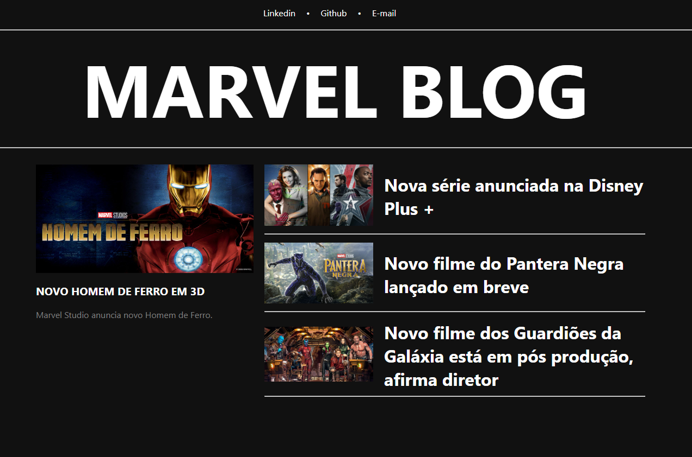

# Blog Angular
<h1>
    
</h1>

# Indice

- [Sobre](#-sobre)
- [Tecnologias utilizadas](#-tecnologias-utilizadas)
- [Como baixar o projeto](#-como-baixar-o-projeto)

## 🔖&nbsp; Sobre

O projeto **Blog** foi criado utilizando os conceitos básicos do Angular, baseado em layout do dribbble, projeto desenvolvido dentro do Bootcamp da DIO [Criando um Blos com Angular, Dio](https://www.dio.me/).

---

## 🚀 Tecnologias utilizadas

O projeto foi desenvolvido utilizando as seguintes tecnologias:

- [HTML](https://developer.mozilla.org/pt-BR/docs/Web/HTML)
- [CSS](https://developer.mozilla.org/pt-BR/docs/Web/CSS)
- [JavaScript](https://developer.mozilla.org/pt-BR/docs/Web/JavaScript)
- [TypeScript](https://www.typescriptlang.org/)
- [Angular](https://angular.io/)

---

## 🗂 Como baixar o projeto

```bash
    # Clonar o repositório
    $ git clone https://github.com/KellyVasconcellos/blog-angular.git
    # Entrar no diretório
    $ cd blog-angular
```

---

Desenvolvido 💜 por Kelly Vasconcellos
